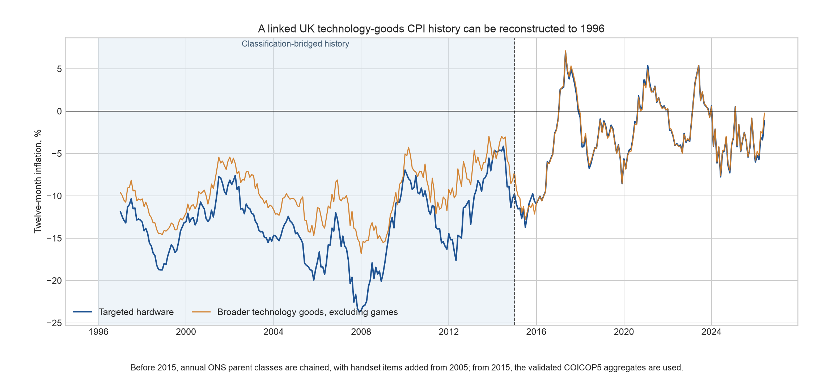
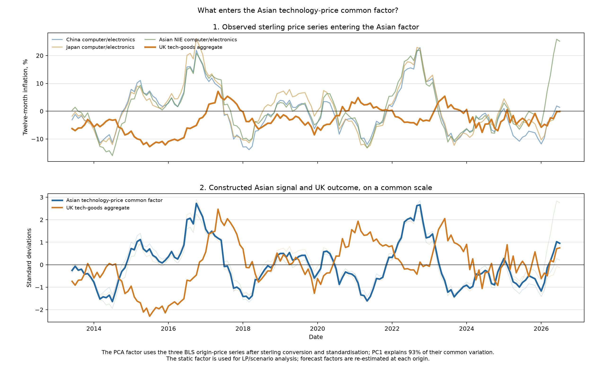
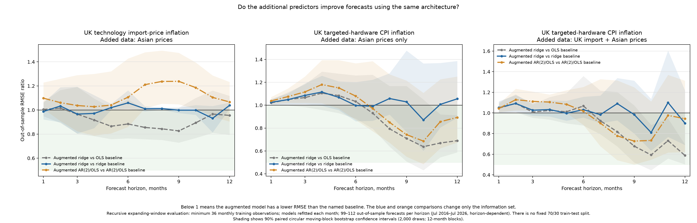
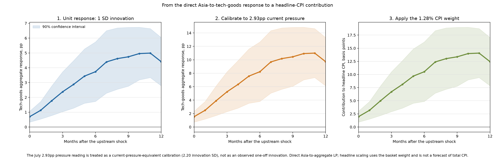
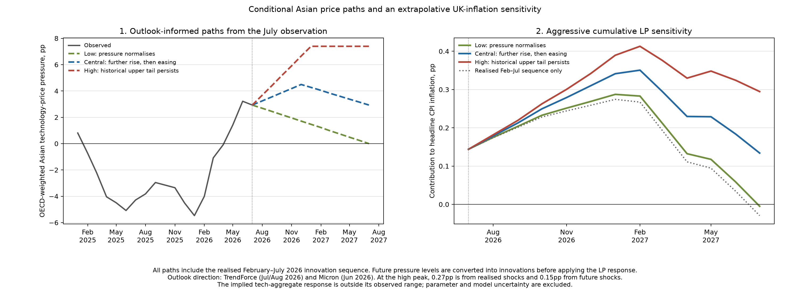

# Asian technology prices and UK inflation

## Question and data

Asian technology prices have risen sharply, but UK electronics import prices and
technology CPI remain subdued. Do Asian prices provide an early warning of UK
inflation? We combine sterling export and producer-price indices for China,
Japan and the Asian NIEs with OECD import-exposure measures and ONS import
prices. To lengthen the UK target, official predecessor classes and handset
items are linked to the current ONS technology basket. The resulting targeted-
hardware series and broader UK tech-goods aggregate extend to 1996 and closely
reproduce the current classification in their overlap.

## Results

The Asian indicators contain a strong shared technology-price cycle. In raw
annual inflation rates, several national and OECD-weighted measures lead the UK
tech-goods aggregate. This is evidence of a persistent global cycle appearing
upstream before reaching UK retail prices. Pre-whitened relationships are
weaker, showing that the result concerns a common cycle rather than a sequence
of isolated shocks.

Extending the lead search from 12 to 18 months confirms that the strongest China
and OECD-weighted relationships peak at about 12 months and then decline, rather
than continuing to strengthen beyond the original window.

Individual indicators and the PCA factor are not consistent C26 forecasters.
The Asian ridge improves on an OLS controls benchmark, but a like-for-like ridge
baseline shows that most of this gain comes from regularisation rather than the
extra Asian variables. A no-ridge comparison is clearer still: adding Asian
prices raises C26 forecast RMSE at every horizon. At the CPI stage, however,
adding UK import and Asian prices to the same AR(2)/OLS architecture reduces
targeted-hardware forecast RMSE by around 10–27% at seven to ten months. A ridge
baseline captures much of this gain, leaving the clearest incremental ridge
improvements at ten and twelve months. This is predictive evidence, not an
identified Asia-to-C26-to-CPI causal chain. An Asian-only CPI model produces
similar longer-horizon OLS point gains, but 90% block-bootstrap intervals include
one, so the size of the improvement is uncertain.

A smooth ARDL robustness test over lags zero to six does not strengthen the
forecast evidence. Regularised Asian lags provide only small, imprecise C26 gains
around five to six months and generally worsen the CPI forecasts. The combined
Asian/import ARDL is unstable, particularly at eleven to twelve months, while
unregularised specifications perform worse still. All ARDL results are evaluated
on the same recursive forecast origins as the main models.

## Implication

Direct local projections estimate the UK tech-goods aggregate’s horizon response
to a one-standard-deviation Asian-factor innovation. We report that unit response,
calibrate it to the latest observed upstream pressure and apply the aggregate’s
CPI basket weight to obtain a contribution to headline inflation. This is a
transparent current-pressure calibration, not a forecast of total CPI or an
identified structural pass-through coefficient.

## Scenarios

Three conditional paths translate the memory-market outlook into low, central
and high paths for the Asian technology-price pressure aggregate. The directions
reflect continued tight supply but moderating consumer-price gains in
[TrendForce’s outlook](https://www.trendforce.com/presscenter/news/20260703-13134.html)
and tight supply beyond 2027 in
[Micron’s outlook](https://investors.micron.com/static-files/2354ecda-77a0-4ddd-8462-a631eb491356).
Each projected level path is converted into monthly innovations and combined
with the realised current-shock sequence before applying the local-projection
responses. The resulting headline-CPI contributions are conditional risk paths,
not central inflation forecasts; this cumulative exercise is deliberately the
more aggressive sensitivity and extrapolates beyond the tech-goods aggregate’s
observed positive range.

