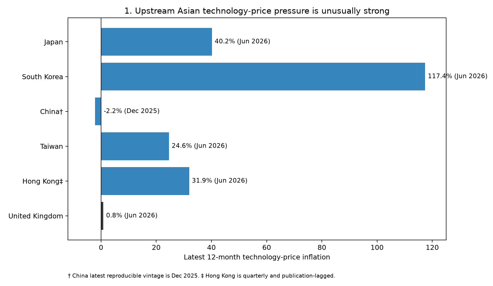
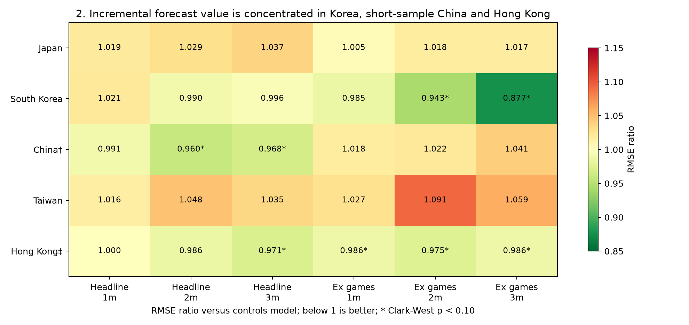
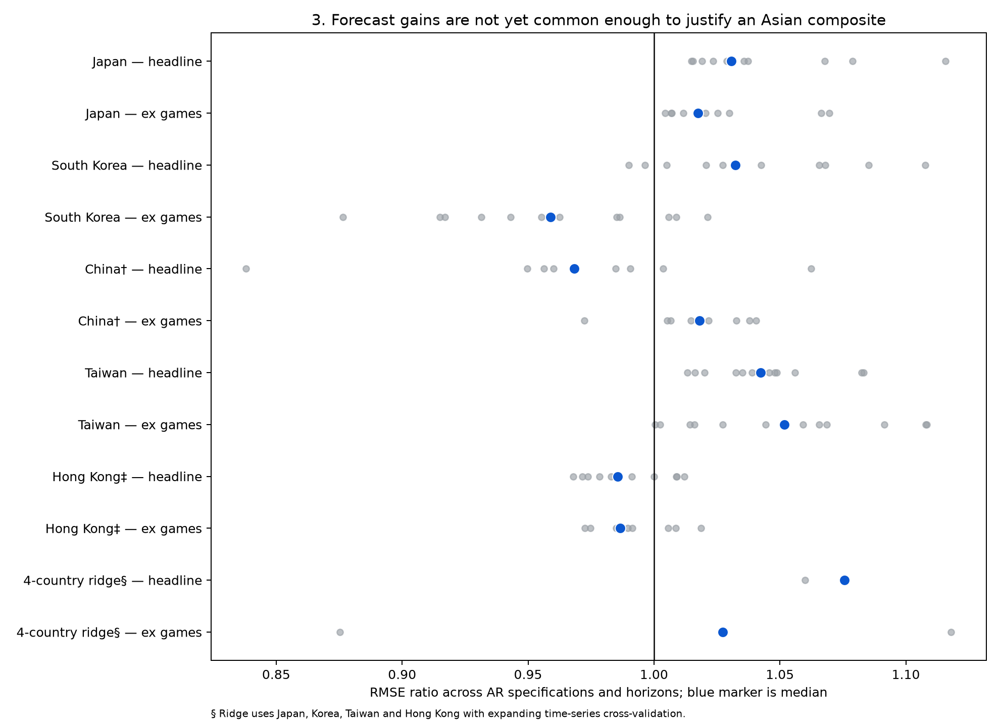

# Killer conclusion

Upstream Asian technology-price pressure is plainly elevated: the latest annual rates are 117.4% in Korea, 40.2% in Japan, 31.9% in Hong Kong and 24.6% in Taiwan, against only 0.8% for the UK technology-goods CPI aggregate. China is the exception at -2.2% in its latest reproducible December 2025 vintage. This is strong corroborating evidence that a global technology-price shock is under way, but it is not evidence that the shock passes quickly or mechanically into quality-adjusted UK retail prices.

Forecast value is selective rather than general. Korea improves the ex-games AR(2) forecast at two and three months (RMSE ratios 0.943 and 0.877); short-sample China improves the headline at two and three months (0.960 and 0.968); and Hong Kong produces small gains that weaken in rolling-window checks. Japan and Taiwan do not improve the primary forecasts, the economically credible pre-whitened leads are not stable, and the cross-validated four-country ridge model worsens headline forecasts at every horizon. The results therefore reject a single common Asian leading indicator at present.

The operational recommendation is to use Korea as a corroborating indicator for the ex-games basket, treat China as an emerging short-sample signal, and use Hong Kong only around turning points; Japan and Taiwan remain useful checks on whether upstream pressure is broad. Do not add a mechanical forecast adjustment or country-weighted composite yet. Re-estimate each round, focus judgement on the matched UK telecom/computing and audio-visual components, and promote an indicator only when gains persist across target definitions, horizons, windows and post-pandemic vintages.
