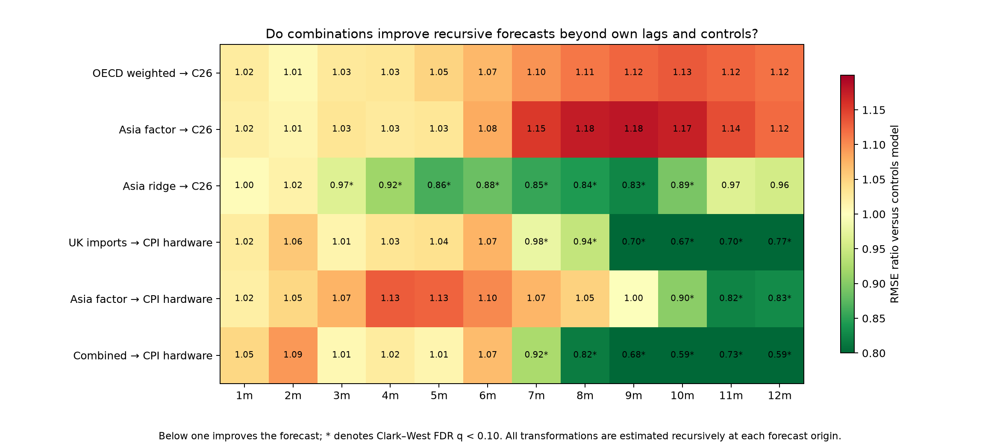

# Killer conclusion

The UK evidence is no longer confined to the post-2015 COICOP5 sample. Linking
official ONS predecessor classes and handset items to the validated current
aggregate gives a targeted-hardware history back to 1996; its overlap annual-rate
correlation with the current construction is 0.986. Over the common international
sample, China, Japan and Asian-NIE electronics prices share a pronounced regional
cycle: one factor explains 94.4% of their standardised variation.

The predictive signal is in the combination, not a fixed single-country lead. A
recursively cross-validated Asian ridge model reduces UK C26 import-price forecast
RMSE by about 8–17% at 4–10 months. Combining Asian prices with UK import prices
also materially improves targeted-hardware CPI forecasts at 7–12 months in the
full sample. But the useful window moves—from nearer 3–5 months for C26 before
2020 to 8–12 months after 2022—so this should be treated as a monitored horizon
band rather than a structural lag.

The current OECD/BLS calculation implies 3.13pp of Asian-origin C26 import-price
pressure and 0.040pp on headline CPI under complete pass-through. Historical C261
coefficients instead imply only about 0.005–0.007pp over the first three months,
and are not robust after multiple-testing adjustment. The senior message is that
upstream risk is coherent and forecast-relevant, but the import-to-retail step is
absorbed or distorted by margins, product mix and quality adjustment. Monitor the
weighted exposure and combined model, then use C261/C26 and retail evidence as the
trigger for CPI judgement.
