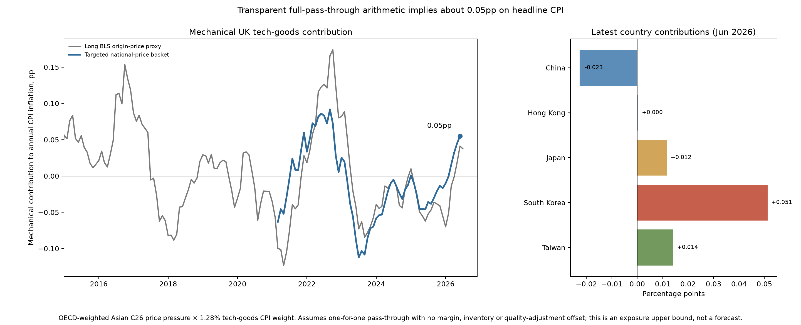
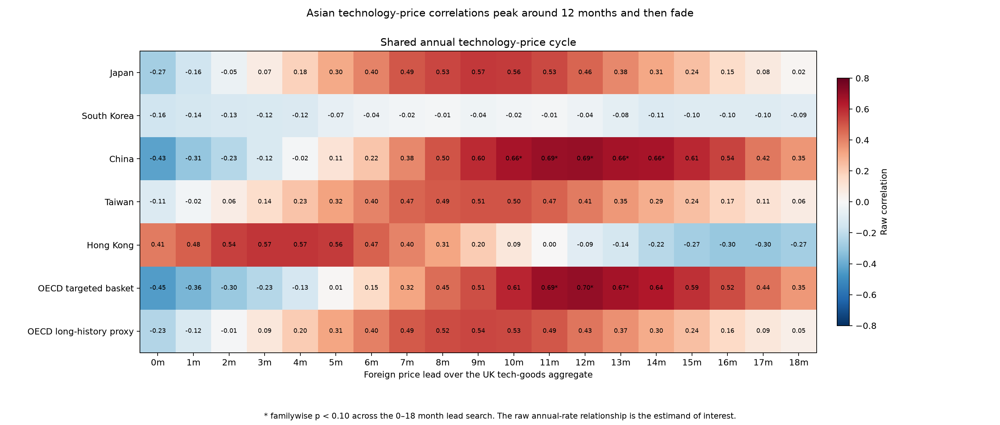
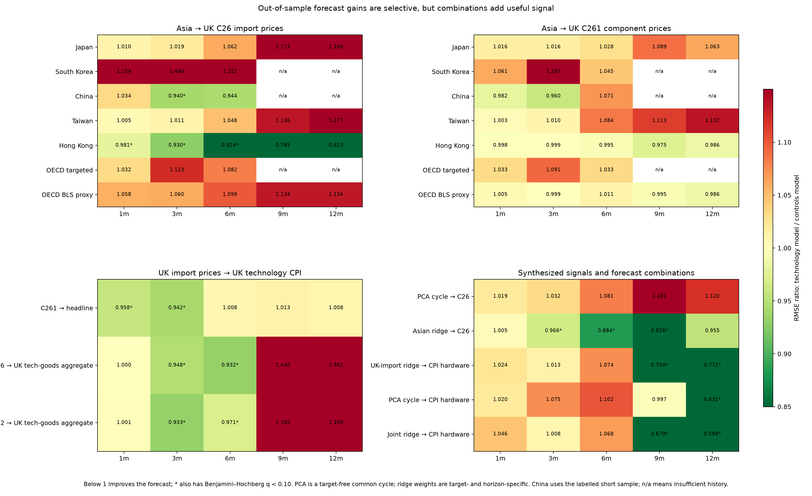
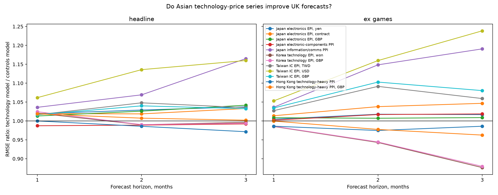
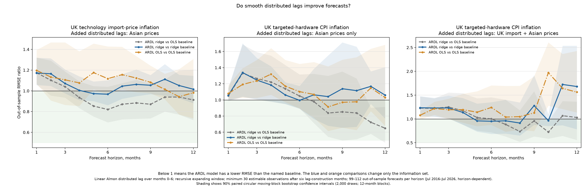

# Do Asian technology prices provide a timely signal for UK technology-goods inflation?

## Executive answer

Asian technology prices are useful as an upstream risk monitor, but the
historical relationship is not strong enough to generate an automatic UK CPI
adjustment. Raw annual-rate correlations provide strong evidence that some
sterling Asian prices and aggregated indices lead the preferred UK CPI
aggregate excluding games by about 9–12 months. This is a substantive result
about the shared global technology-price cycle, even though it is not an
incremental-shock estimate. The relationships weaken sharply after removing
each series' own persistence, while recursive forecasting provides a separate
test of whether the signal was usable in real time.

The strongest operational result comes from combining information rather than
selecting one country. A recursively estimated ridge combination of the longer
China, Japan and Asian-NIE electronics price series improves UK C26 import-price
forecasts at 3–10 months in the full sample. A model combining those Asian
prices with UK C26/C261/C262 import prices also improves long-horizon targeted-
hardware CPI forecasts. The useful horizon shifts across subperiods, so these
are monitored forecast bands rather than a fixed structural lag.

The OECD exposure calculation currently implies a mechanical contribution of
about **0.05 percentage points** to annual ex-games CPI inflation under full
pass-through, compared with the 0.25pp internal estimate supplied as a
benchmark. This is an exposure scenario rather than a forecast. It excludes
unobserved Asian origins and may use a narrower basket or different production
weights than the internal calculation, while also making the deliberately
strong assumption that upstream price changes pass fully into UK retail prices.

The recommended forecast process is therefore sequential. Use the
OECD-weighted sterling basket to measure the upstream shock; use Hong Kong and
the individual Korean and Taiwanese measures as canaries for regional breadth;
wait for C26 and especially C261 UK import prices to confirm that pressure has
reached the UK border; and apply component-level judgement only when UK-facing
prices or retail evidence also move.

Data vintage: 24 August 2026. OECD TiVA data are the revised 2025 edition and run
to 2022. Monthly UK CPI and most UK import-price data run through July 2026.

## 1. Question and preferred measures

The research question is whether technology-specific export or producer prices
in Japan, South Korea, China, Taiwan and Hong Kong provide timely information
for UK CPI technology-goods inflation.

The preferred UK target is the validated COICOP5 technology aggregate excluding
games and hobbies. Games are excluded because the component contains software
and non-technology products as well as consoles. Consoles remain economically
relevant and should eventually be monitored separately rather than allowing
the entire games category to dominate the aggregate.

Headline foreign-price analysis now uses sterling versions only. This places
foreign producer prices and exchange-rate changes into the same price concept
and matches the cost faced by a UK importer more closely. Models use a broad
sterling Asian import-price control rather than reintroducing each bilateral
exchange rate alongside the converted series.

## 2. Data extensions

### 2.1 National technology-price indicators

The targeted measures remain:

| Economy | Preferred measure | Main interpretation | Limitation |
|---|---|---|---|
| Japan | BOJ electronics export-price index | Long electronics benchmark | Broad electronics mix |
| South Korea | BOK computer/electronic/optical export-price index | Strong current memory and semiconductor signal | Consistent targeted history starts in 2019 |
| China | NBS computer/communications/electronics PPI | Downstream manufacturing and assembly conditions | Reproducible monthly history starts in 2021 |
| Taiwan | DGBAS integrated-circuit export-price index | Clean semiconductor indicator | Semiconductor-heavy rather than finished-goods measure |
| Hong Kong | Technology-heavy quarterly PPI | Regional pricing and re-export conditions | Broad, quarterly and not an original-production measure |

Japan and Taiwan have materially longer targeted histories, while Hong Kong has
a long broad export unit-value control. Earlier Korean classifications and
Chinese annual series exist, but they are not silently spliced into the modern
monthly targeted indicators because their coverage and frequency differ.

### 2.2 Comparable longer-history border-price proxy

The [US Bureau of Labor Statistics](https://www.bls.gov/mxp/) publishes monthly
computer-and-electronics import-price indices by origin for China, Japan and
the Asian newly industrialised economies from June 2012. The latter group
contains Hong Kong, Singapore, South Korea and Taiwan. These series are
converted from dollars into sterling and combined using the OECD weights.

This adds a common monthly history beginning in 2013 after annual-rate
transformation. It is kept separate from the national series because it records
prices at the US border rather than Asian producer or export prices. It is a
useful robustness proxy, not a splice.

### 2.3 Linked pre-COICOP5 UK target

The official ONS item archive and predecessor classes permit a transparent UK
classification bridge. COICOP 09.1.1 audio-visual, 09.1.2 photo/optical and
09.1.3 information-processing indices are chained with their annual ONS
weights; handset item indices are added from 2005; and the series is linked to
the validated COICOP5 aggregate in January 2015. A broader ex-games sensitivity
also includes historical 09.1.4 recording media.

The targeted-hardware bridge begins in 1996. Against 44 common annual-rate
observations from 2016 to August 2019, it has a correlation of 0.986 and RMSE of
1.08pp relative to the current-classification construction. This creates a
genuine pre-2020 forecast evaluation, while retaining an explicit classification-
break caveat. The broader ex-games bridge is less exact and is used as a
sensitivity. Full details are in
[`uk_measure_extension_and_transmission.md`](uk_measure_extension_and_transmission.md).

## 3. OECD import-content weighting and mechanical contribution

The [OECD 2025 Inter-Country Input-Output
tables](https://www.oecd.org/en/data/datasets/inter-country-input-output-tables.html)
trace the country origin of value added embodied in UK gross imports of C26
computer, electronic and optical products. This captures Korean or Taiwanese
content embodied in a finished good exported from China or another country,
which direct customs partner shares can miss.

The latest available 2022 shares are:

| Value-added origin | Share of all UK C26 import content | Share within the five economies |
|---|---:|---:|
| China | 39.6% | 75.7% |
| Taiwan | 5.3% | 10.2% |
| South Korea | 4.1% | 7.9% |
| Japan | 3.2% | 6.0% |
| Hong Kong | 0.1% | 0.2% |
| **Five-economy total** | **52.3%** | **100.0%** |

For country \(i\), the upstream contribution is:

\[
P_t = \sum_i s_i \pi^{GBP}_{i,t},
\]

where \(s_i\) is its share of all UK C26 import content and
\(\pi^{GBP}_{i,t}\) is its sterling technology-price inflation rate. The
mechanical contribution to annual ex-games CPI inflation is:

\[
C_t = P_t \times \frac{w^{CPI}_t}{1000}.
\]

This assumes that the ex-games basket is fully import exposed and that the
weighted upstream price change passes through one-for-one. It deliberately
does not estimate margins, contracts, inventories or quality adjustment.

The latest targeted estimate is **0.055pp** in June 2026, its latest common
country observation. South Korea contributes +0.051pp, Taiwan +0.014pp, Japan
+0.012pp, Hong Kong close to zero and China -0.023pp. The longer BLS proxy gives
0.041pp in June and its July pressure reading is 2.93pp. The targeted series has
not exceeded 0.092pp in its available history; the longer proxy peaked at
0.174pp during 2022.

The public-data estimate can differ from 0.25pp because the internal exercise
may include a broader Asian set, use weights normalised within Asia, apply a
larger CPI destination, use more targeted current prices, or model production
content differently. The internal workbook or exact weights are required for a
full reconciliation. Until then, 0.25pp is shown as a comparator rather than a
calibration target.

## 4. Raw versus pre-whitened co-movement

The raw correlations are the primary estimand for the shared-cycle question.
Pre-whitening remains useful as a deliberately narrower robustness diagnostic:

- raw annual-rate correlations ask whether foreign and UK prices moved through
  the same broad cycle;
- pre-whitened correlations ask whether an unexpected foreign-price movement
  was followed by an unexpected UK movement; and
- recursive forecasts ask whether the foreign measure would have improved a
  real-time UK forecast beyond own lags and broad controls.

For ex-games CPI, China's sterling targeted PPI has a raw common-sample
correlation of 0.69 at a 12-month lead and the OECD-weighted targeted basket has
a correlation of 0.67 at an 11-month lead. Both survive the within-indicator
0–12-month circular-shift search. Japan, Taiwan, Hong Kong and the long BLS
proxy also show raw peaks around 0.52–0.57, mainly at 3 or 9 months.

An additional 0–18-month sensitivity scan checks whether the peaks at the edge
of the primary window continue strengthening. They do not. On the common
18-month sample, China peaks at 12 months (correlation 0.69) and falls to 0.35 by
18 months; the OECD-weighted targeted basket also peaks at 12 months
(correlation 0.70) and falls to 0.35. Both peaks survive the familywise
adjustment across the wider 0–18-month search. The pre-whitened correlations at
the same leads remain close to zero. This supports a broad cycle with a peak
around one year, rather than a relationship that continues strengthening at
longer leads.

These results are substantively important: the object being measured is a
shared global technology-price cycle that appears in Asian producer and export
prices before UK retail prices. Removing each series' own dynamics also removes
much of that persistent cycle, so the smaller pre-whitened estimates do not
invalidate the raw result. They instead show that the evidence is about the
timing of a common cycle rather than a sequence of isolated independent shocks.
The correlations still do not by themselves identify causality or a fixed
pass-through coefficient; that is why the recursive forecast evidence is
reported separately.

## 5. Recursive forecast evidence

Every model forecasts horizons from one to twelve months using data that would
have been available at the forecast origin. The primary comparison adds one
sterling technology-price measure to UK inflation lags and broad sterling price
controls. Robustness covers AR(1), AR(2), AR(6), a rolling 60-month window,
post-2022 evaluation, Clark–West tests and false-discovery-rate adjustment.

### 5.1 Direct forecasts of ex-games CPI

The OECD-weighted long BLS proxy improves the primary ex-games forecast at
1–4 months, with RMSE ratios of 0.97, 0.97, 0.95 and 0.97. All four
lag/window specifications improve over these short horizons, and the median
post-2022 RMSE ratio strengthens from about 0.96 at one month to 0.89 at four
months.

The same proxy also produces large apparent gains at 11–12 months. Those gains
are much stronger during the pandemic evaluation and do not survive
false-discovery adjustment post-2022. They should be treated as a pandemic
cycle result, not a validated long lead.

The targeted OECD basket has a small primary improvement around five months
(RMSE ratio 0.94, 17 forecast errors) but no stable pattern. Hong Kong produces
modest ex-games gains around 3–5 months; Japan and Taiwan are mixed; and Korea's
short sterling sample does not reproduce the earlier local-currency short-lead
result consistently.

### 5.2 Asian prices to UK import prices

Hong Kong's sterling technology-heavy PPI is the clearest C26 canary. It
improves all four model specifications from about 5–10 months and remains
helpful at 11–12 months, including post-2022 estimates. This is economically
plausible as a regional pricing or re-export signal, but not as a mechanical
country contribution: OECD attributes only 0.1% of UK C26 import content to
Hong Kong.

The long OECD/BLS basket does not improve full-sample C26 forecasts and is close
to neutral for C261. The targeted OECD basket also fails at short horizons and
shows only unselected gains around 7–8 months. This means the weighted
aggregate cannot currently support a statement that Asian prices generally
reach UK border prices after a fixed number of months.

### 5.3 UK import prices to CPI

The earlier border-price conclusion is unchanged. C261 electronic-component
import prices improve headline technology-CPI forecasts at 1–4 months across
the main robustness specifications. C26 and C262 sometimes improve ex-games
forecasts at 3–6 months, but that result is weaker post-2022 and reverses at
long horizons. There is no robust general 9- or 12-month UK-border-to-retail
relationship.

The two stages must therefore not be mechanically added together. Hong Kong may
signal regional conditions well before UK C26 moves, while the weighted basket
can help the direct CPI forecast without reliably forecasting C26. These are
monitoring associations, not an identified structural supply chain.

### 5.4 Common factors and combined forecasts

The synthesis exercise constructs two different objects from the longer
sterling BLS electronics price indices for China, Japan and the Asian NIEs. The
first principal component is target-free: at every forecast origin it
standardises the three available series and estimates the direction of greatest
shared variation. The full-sample diagnostic has similar positive loadings and
explains 93.3% of standardised variation, so it is best interpreted as a common
regional price-cycle factor, not an exposure-weighted basket.

The ridge specification is supervised and should not be described as one fixed
index. For each target, horizon and forecast origin, it standardises the same
three origin-price series together with the baseline predictors and uses
time-series cross-validation to choose the shrinkage penalty. Its effective
weights can therefore differ by target, horizon and vintage. Relative to the OLS
controls benchmark, the Asian ridge reduces C26 RMSE by roughly 8–17% at several
4–10 month horizons. A like-for-like controls-only ridge reveals that most of
this gain comes from regularisation: adding the Asian series changes RMSE by only
about -3% to +6% over 1–10 months, before a 7% improvement at eleven months.
There is therefore little evidence of a broad, stable incremental forecasting
gain from the Asian data alone.

The no-ridge comparisons sharpen the distinction between the two forecast
targets. Adding Asian prices to the C26 AR(2)/OLS model raises RMSE at every
horizon. By contrast, adding UK import and Asian prices to the targeted-hardware
AR(2)/OLS model reduces RMSE by about 10% at seven months, 22% at eight months and
27% at nine to ten months. The second-stage predictor block therefore contains
useful longer-horizon information under the common OLS architecture.

A direct Asian-only targeted-hardware model provides an important middle case.
Its OLS RMSE is 15% lower at eight months, 26% lower at nine months and 31% lower
at ten months, suggesting that the Asian block accounts for much of the combined
model's longer-horizon point improvement. The Asian-only ridge is not consistently
better than the controls-only ridge. All of the bootstrap intervals around the
apparent longer-horizon improvements include one, however, so this evidence is
indicative rather than precise.

For targeted-hardware CPI, the combined UK-import/Asian ridge reduces RMSE
relative to the OLS controls model by about 32% at nine months and 41% at ten and
twelve months. However, a controls-only ridge already captures much of that gain.
Against the like-for-like ridge baseline, the combined model's clearest gains are
19% at ten months and 10% at twelve months, with mixed performance elsewhere.
The location of the gains also changes across subperiods, so the model should be
used as a forecast ensemble rather than evidence for one invariant pass-through
lag.

The evaluation is recursive rather than a single holdout split. Each model first
uses at least 36 monthly observations and is then refitted at every forecast
origin using an expanding window. Depending on the horizon, there are 99–112
out-of-sample forecasts with target dates spanning July 2016 to July 2026. The
reported 90% RMSE-ratio intervals use a paired circular moving-block bootstrap
with 2,000 draws and 12-month blocks.

### 5.5 Smooth distributed-lag robustness

An ARDL robustness exercise allows the added price series to enter through lags
zero to six. To avoid estimating seven independent coefficients for every series,
each lag profile is represented by a linear Almon polynomial with two basis
terms. Both OLS and time-series-cross-validated ridge versions are compared with
like-for-like controls-only baselines. The six lag-construction months plus 30
initial regression observations preserve the same 36-month starting history as
the main models. The ARDL forecasts are restricted to exactly the same recursive
target–horizon–origin cells: 99–112 forecasts per horizon, covering target dates
from July 2016 to July 2026.

The smooth Asian lag block gives the C26 ridge forecast point gains of only about
3% at five to six months; the 90% intervals include an RMSE ratio of one, while
one-to-two-month performance is significantly worse. Asian lags alone generally
worsen targeted-hardware CPI forecasts. Adding both Asian and UK-import lag
profiles produces small ridge gains at five to eight and ten months, but becomes
very unstable at eleven to twelve months. The OLS ARDL models mostly raise RMSE
and deteriorate sharply at long horizons, demonstrating why an unrestricted
distributed-lag panel would be poorly matched to this sample size.

Local projections reinforce the caution. C261 import-price coefficients are
positive over the first few months but imprecise after multiple-testing
adjustment and reverse later. The current 2.93pp upstream C26 pressure maps to a
0.038pp headline contribution under full pass-through, but only about 0.004–
0.007pp using the illustrative early C261 coefficients. Neither calculation is
a central forecast: the former is an upper mechanical exposure and the latter
is a noisy historical association.

### 5.6 Conditional current-shock scenarios

The scenario extension treats the common Asian factor as an AR(2) process and
extracts its unexpected innovations. Innovation local projections make the UK
border response detectable within 1–3 months and place its peak around 3–6
months, with the strongest technology-CPI association at 9–11 months. These are
an innovation-based complement to the raw common-cycle correlations, which peak
around 4–6 months for imports and 10–12 months for CPI. They answer a narrower
question and should not displace the shared-cycle timing result.

Dynamic ARDL models then condition on three paths for the latest 2.93pp upstream
pressure. If it is sustained, the central ex-games contribution builds to about
0.042pp on headline CPI after six months, 0.080pp after nine months and 0.125pp
after twelve months. If pressure intensifies to the historical 95th percentile,
the twelve-month contribution reaches about 0.34pp. These estimates have wide
parameter and specification uncertainty and are scenarios rather than forecasts.
The full results are in
[`scenario_transmission_results.md`](scenario_transmission_results.md).

## 6. Economic interpretation

The statistical winner and the economically most relevant measure need not be
the same:

- **Korea and Taiwan** are the most relevant indicators of the current AI,
  memory and semiconductor cost shock;
- **China** dominates the embodied value of UK C26 imports and represents the
  assembly and finished-goods channel, but its current sterling PPI contribution
  is negative;
- **Japan** provides a long electronics benchmark;
- **Hong Kong** has the clearest historical C26 lead but should be treated as a
  canary because it is a re-export hub and has negligible production-origin
  weight; and
- **the OECD weighted baskets** provide transparent exposure measures, but the
  targeted version is too short and the longer BLS version is a US-border proxy.

Quality adjustment is especially important. A higher chip or memory cost may
appear as more memory, faster performance or a redesigned product rather than a
higher quality-adjusted CPI price. Firms can also absorb costs in margins,
renegotiate contracts, run down inventories or reallocate product ranges. This
explains why a large upstream shock can coexist with weak UK retail inflation.

## 7. Monitoring and forecast-judgement rule

The recommended monthly dashboard has four layers:

1. **Upstream exposure:** OECD-weighted targeted sterling basket, its mechanical
   CPI contribution and its country decomposition.
2. **Regional canaries:** Hong Kong for C26 timing; Korea and Taiwan for the
   breadth and intensity of memory/semiconductor pressure.
3. **UK-border confirmation:** C26 and especially C261 import-price inflation.
4. **Retail localisation:** ex-games CPI, targeted hardware and the relevant
   mobile, computer, AV, photographic and recording-media components.

The forecast rule should be:

- do not add a CPI judgement when only the upstream basket rises;
- mark the risk as elevated when several Asian indicators rise and the
  mechanical contribution increases materially;
- consider a component-level judgement when C26/C261 or credible UK retail
  evidence confirms transmission; and
- review the judgement when margins, inventories or quality-adjusted retail
  prices suggest that the shock is being absorbed.

The preferred senior statement is:

> Asian technology prices show a material upstream inflation risk, but the
> historical relationship does not provide a stable mechanical UK CPI lead.
> Raw co-movement points to a possible 9–12-month risk window, while robust
> incremental forecast value is concentrated nearer 1–4 months and in selected
> border-price canaries. The OECD-weighted public-data calculation currently
> implies about 0.05pp under full pass-through, so UK import prices should be
> used as the trigger for forecast judgement rather than Asian prices alone.

## 8. Reproducibility and remaining work

The OECD downloader, checksum manifest, ONS classification bridge, exposure
weights, sterling composites, raw/pre-whitened correlations, principal
component, regularised combinations, local projections and 1–12-month recursive
forecasts are all part of the Python/`uv` pipeline.

The highest-value remaining task is to obtain the International Directorate's
exact OECD weights and calculation so that the 0.25pp estimate can be
reconciled line by line. A second-stage extension could create a console and
storage-device satellite using customs codes or matched retail prices, but it
is not required to answer the main essay question.
