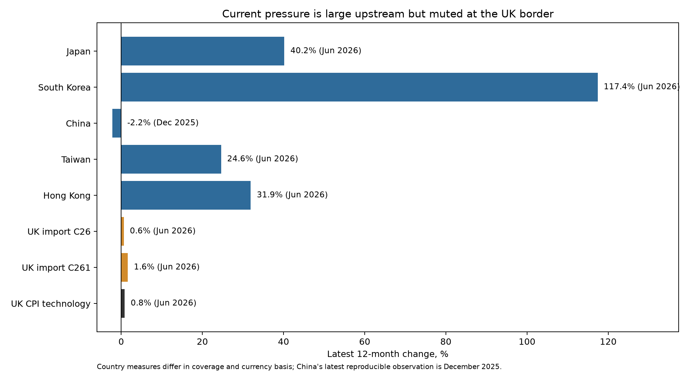
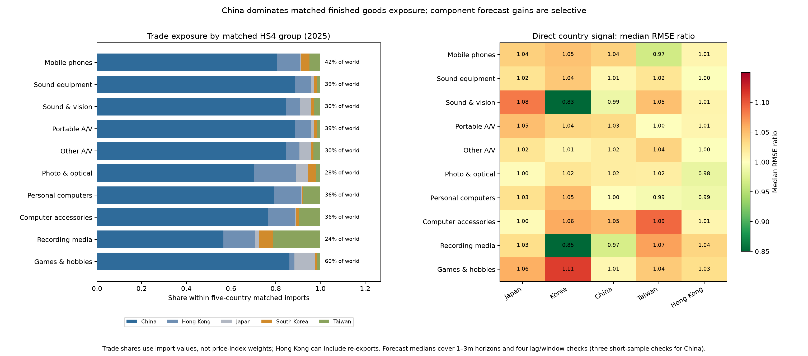

# Do technology-specific export or producer prices in major Asian economies provide a useful timely signal for UK CPI technology-goods inflation?

## Executive answer

**They provide useful but selective corroborating information; they do not yet
form a stable mechanical leading indicator for the UK aggregate.** Upstream
technology-price inflation is currently very high in South Korea, Japan, Hong
Kong and Taiwan, while the corresponding UK border-price measures remain
subdued. South Korea is the only country that robustly improves forecasts of
the broad UK C26 electronics import-price index at all one-to-three-month
horizons. However, no foreign series robustly forecasts the more detailed C261
electronic-components import-price index, which is the UK border measure that
most consistently improves forecasts of headline UK technology-goods CPI.
The two useful links therefore do not join into one validated pass-through
chain.

The practical conclusion is to monitor Asian prices as evidence about the
direction and breadth of upstream pressure, while using the ONS C261 import
price index as the nearer-term UK-facing indicator. South Korea deserves the
most weight as a corroborating foreign indicator; Taiwan is useful at broader
C26 turning points and for mobile-phone component risk; China and Hong Kong
should remain event and turning-point checks; Japan is a breadth check rather
than a forecast input. A mechanically weighted Asian composite or automatic UK
CPI add-factor is not justified.

The checked-in data vintage is 29 July 2026. The UK CPI and main ONS import
price series run through June 2026; HMRC trade data run through May 2026;
China's reproducible PPI archive ends in December 2025; and the discontinued
C262 computer import-price detail ends in September 2025.

## 1. Question and decision rule

The project asks whether technology-specific export or producer prices in
Japan, South Korea, China, Taiwan and Hong Kong add timely information for a
validated ten-component UK COICOP5 technology-goods CPI aggregate.

An indicator is judged useful only if it:

1. improves recursive one-to-three-month forecasts relative to UK inflation
   lags, exchange rates and broader price controls;
2. retains the result across lag choices, estimation windows and the aggregate
   excluding games;
3. has a plausible link through UK import prices and matched products;
4. is available in time for the UK forecast round;
5. is not solely a pandemic result; and
6. survives reasonable protection against specification and indicator
   selection.

This is deliberately stricter than finding the largest in-sample correlation.

## 2. Data and construction

### 2.1 UK CPI targets

The headline target is a chain-linked, annually reweighted aggregate of L7GG,
L7GM, L7GP, L7GQ, L7GR, D7EO, L7GT, L7GU, L7GY and L7H9. The component index
and weight CDIDs were downloaded from the [ONS CPI time-series
dataset](https://www.ons.gov.uk/economy/inflationandpriceindices/datasets/consumerpriceindices).
The aggregate was independently validated against the user's existing series.
Because L7H9 covers games and hobbies more broadly than technology goods, the
analysis also uses an aggregate excluding games.

All CPI targets and predictors are converted to 12-month percentage changes for
the common comparison with China's published annual-rate measure. The source
indices are not seasonally adjusted; annual changes also reduce, but do not
eliminate, seasonal effects.

### 2.2 Asian price indicators

| Economy | Primary technology measure | Frequency and basis | Principal limitation |
|---|---|---|---|
| Japan | BOJ export price index for electric and electronic products | Monthly; yen, contract-currency and sterling versions | Broad electronics coverage; no forecast gain in this exercise |
| South Korea | BOK export price index for computers, electronic and optical equipment | Monthly; won and sterling versions | Short primary forecast evaluation; older classification is broader |
| China | NBS PPI for computers, communications and other electronic equipment | Monthly annual rate; local and sterling-adjusted versions | Reproducible history begins in 2021 |
| Taiwan | DGBAS integrated-circuit export price index | Monthly; TWD, USD and sterling versions | Narrow semiconductor measure rather than finished-goods basket |
| Hong Kong | C&SD PPI for a technology-heavy manufacturing group | Quarterly, release-lagged in the monthly panel | Includes metals and machinery; Hong Kong is also a re-export hub |

Local-currency versions answer whether producer prices themselves contain a
signal. Sterling-adjusted versions answer whether exchange-rate movements
strengthen or offset that pressure. Broad national export/producer prices and
bilateral sterling exchange rates enter as controls rather than being credited
to the technology-specific indicator.

### 2.3 UK border prices

The ONS PPI dataset supplies monthly import-price indices for:

- [all manufactured products (GB8U)](https://www.ons.gov.uk/economy/inflationandpriceindices/timeseries/gb8u/ppi);
- [C26 computer, electronic and optical products (G68Q)](https://www.ons.gov.uk/economy/inflationandpriceindices/timeseries/g68q/ppi);
- [C26 non-EU imports (G6PT)](https://www.ons.gov.uk/economy/inflationandpriceindices/timeseries/g6pt/ppi);
- [C261 electronic components and boards (EZSQ)](https://www.ons.gov.uk/economy/inflationandpriceindices/timeseries/ezsq/ppi);
- C261 non-EU imports (EZXC);
- C262 computers and peripherals (EZSR); and
- C262 non-EU imports (EZXD).

The all-manufactures index and GBP/USD are controls in the UK border-to-CPI
models. Total and non-EU technology indices are tested separately. C262 is
retained as a historical robustness measure but is not extrapolated past its
September 2025 endpoint.

### 2.4 Product and country exposure

The [HMRC UK Trade Info API](https://www.uktradeinfo.com/api-documentation)
provides monthly import values aggregated by partner and HS4 product. Each CPI
component is mapped to one or more plausible HS4 groups. For example, personal
computers map to HS8471, mobile-phone equipment to HS8517, and computer
accessories to HS8471/8473.

Country weights are shares of the five selected economies' matched import
values. Only completed calendar years produce operational weights, and year
\(t-1\) values become weights in year \(t\), preventing future trade data from
entering a historical forecast. The five economies represent 24–60% of world
imports across the matched 2025 product groups. These are exposure diagnostics,
not CPI or price-index weights: HS4 groups are broader than COICOP5 items,
import values mix prices and quantities, and Hong Kong values can include
re-exports.

## 3. Empirical approach

### 3.1 Co-movement and turning points

Annual inflation rates are charted in local and sterling-adjusted terms.
Lead correlations from zero to twelve months use separate AR(12)
pre-whitening models. Circular-shift p-values protect against choosing the most
attractive lead after inspecting all thirteen.

### 3.2 Recursive forecast tests

For target inflation \(y\), the models directly forecast \(y_{t+h}\), for
\(h=1,2,3\):

- **M0:** current and lagged target inflation;
- **M1:** M0 plus the relevant exchange rate and broad price control;
- **M2:** M1 plus one technology-specific candidate.

The primary model has two autoregressive terms. AR(1), AR(6), and a rolling
60-month AR(2) model are robustness checks. Forecast origins are genuinely
recursive: training at origin \(t\) includes only outcomes observable by
\(t\). The main models require 60 training observations; China has a separately
labelled 36-observation-minimum exercise.

Forecast performance is measured by the M2/M1 RMSE ratio. Values below one
favour the technology series. Clark–West tests account for the nested forecast
models, and Benjamini–Hochberg q-values control the false-discovery rate across
the competing indicators in each pre-specified target, horizon, window and
sample comparison. A result is highlighted only when RMSE improves and
\(q<0.10\).

### 3.3 Pass-through checks

The analysis estimates the two forecast links separately:

1. Asian technology prices to UK C26, C261 and C262 import prices; and
2. UK technology import prices to the aggregate and ten CPI components.

Distributed-lag regressions include two own lags, contemporaneous through
six-month predictor lags, relevant controls and HAC covariance estimates.
Because annual rates overlap and product composition differs, their cumulative
coefficients are descriptive predictive pass-through estimates, not causal
elasticities.

Implementation uses `statsmodels` for OLS and HAC inference and
`scikit-learn` for the previously reported time-series-cross-validated
multi-country ridge robustness model. Project-specific code is confined to
data mapping, release timing and recursive information sets.

## 4. Results

### 4.1 Current pressure is upstream, not yet at the UK border



The latest annual rates are 117.4% in South Korea, 40.2% in Japan, 31.9% in
Hong Kong and 24.6% in Taiwan. China is the exception at -2.2% in December
2025. In contrast, the UK C26 import-price index is up only 0.6%, C261
electronic components 1.6%, and the UK technology CPI aggregate 0.8%.

This is evidence of a large upstream shock, but the gap across layers is also
evidence against applying the foreign rates mechanically to UK retail prices.
Destination-market pricing, contracts, inventories, distribution margins,
sterling, product mix and quality adjustment can all interrupt or delay the
chain.

### 4.2 Historical co-movement does not identify a stable common lead

The earlier pre-whitened scan found a positive five-month Taiwan lead for the
headline target, but Taiwan did not improve the original aggregate forecast
consistently. Several sterling-adjusted Japan and Taiwan correlations and a
Korean six-month correlation had negative signs, which are not credible as
mechanical inflation pass-through signals. Results also changed by sample
period.

The correlation evidence therefore supports using forecast performance and an
explicit border-price link as the main decision criteria. It does not support
choosing a fixed country lead from the raw or pre-whitened correlation peak.

### 4.3 The two statistically useful forecast links do not join


**Asian prices to UK border prices.** South Korean technology export inflation
improves the broad C26 UK import-price forecast at one, two and three months:
the primary RMSE ratios are 0.952, 0.943 and 0.920, with FDR-adjusted q-values
of 0.025, 0.074 and 0.062. The evaluation is short—21 to 24 forecast errors—but
11 of 12 lag/window/horizon checks improve on M1 and all 12 have nominal
Clark–West significance.

Taiwan improves the primary C26 RMSE at two and three months (0.984 and 0.964)
but does not survive the cross-indicator FDR threshold. Its distributed-lag
association with C26 is positive and significant over the full sample, which
makes it a plausible turning-point corroboration rather than a selected
forecast input. Japan worsens C26 forecasts at every primary horizon; Hong Kong
is effectively neutral; and China's apparent three-month improvement is small
and short-sample.

Crucially, none of the five indicators robustly forecasts C261. Korea produces
small C261 gains at one and two months (0.978 and 0.987), but these do not pass
the FDR threshold and the three-month ratio is 1.009. The non-EU C261 results
are weaker.

**UK border prices to UK CPI.** The total C261 index is the strongest headline
predictor: its primary RMSE ratios are 0.960, 0.928 and 0.942, all with
\(q<0.04\). It improves all 12 combinations of horizon and lag/window
specification, with a median ratio of 0.943. The post-2022 ratios are 0.926,
0.925 and 0.934, so this is not a result created solely by the pandemic.

The broad C26 index does not improve headline forecasts. It helps the ex-games
aggregate at two and three months in the full-sample primary model, but the
median result across specifications is slightly worse than M1 and the gain is
not FDR-significant post-2022. C262 produces a three-month ex-games gain but is
unstable across specifications and ends in 2025.

The conclusion is therefore nuanced: Korea gives a useful signal for broad UK
electronics border inflation, and C261 gives a useful signal for headline UK
technology CPI, but no tested Asian series gives a robust timely signal for
C261. That missing middle link prevents a mechanical pass-through rule.

### 4.4 Trade exposure and components sharpen where judgement belongs



China supplies 57–89% of the selected five countries' matched 2025 import value,
depending on the CPI component. Taiwan has its largest share in recording media
(21%) and computer accessories (10%); Hong Kong is relatively important in
photographic/optical equipment (19%) and computing groups (about 12%). These
weights explain exposure, but not predictive content: China's measure is short
and weak at the C261 stage, while Korea has a strong C26 forecast result despite
small direct UK finished-goods import shares. That is economically possible
when a country is informative about global input prices rather than being the
direct origin of the final good.

At component level, the strongest direct-country median RMSE gains occur for
Korea with sound-and-vision equipment (0.83) and recording media (0.85), Taiwan
with mobile phones (0.97), and Hong Kong with photographic/optical equipment
(0.98). These are useful diagnostics, but they are selected from a large grid.
After primary-model FDR adjustment, the clearest individual cells are narrower:
Hong Kong for photographic/optical equipment at two months and Korea/Taiwan
for mobile phones at two months. China produces several attractive cells only
in its labelled short sample.

The UK import-price component results are more coherent. Broad/non-EU C26 and
C262 indices improve photographic/optical and sound-and-vision forecasts at
selected horizons, and C261 improves sound-and-vision inflation. This suggests
placing any judgement at matched component level, particularly sound/vision,
photographic/optical and mobile phones, rather than shifting the whole UK
technology basket.

## 5. Robustness, timing and interpretation

- **Pandemic dependence:** C261's headline forecast gain survives the post-2022
  evaluation. Several other results, especially broad C26 for ex-games, do not.
- **Lag and window choice:** C261-to-headline and Korea-to-C26 are the most
  consistent relationships. Component results are more specification-sensitive.
- **Multiple testing:** Report figures mark only primary cells with both lower
  RMSE and FDR-adjusted \(q<0.10\). Component medians remain exploratory.
- **Publication timing:** Asian monthly data and ONS PPI are normally available
  around the following month's UK forecast round. Hong Kong is explicitly
  shifted to its later quarterly availability. Prior-year HMRC weights prevent
  future trade values entering historical decisions.
- **Vintage limitation:** The exercise respects publication conventions but is
  not a complete real-time vintage database. Recent observations can embody
  revisions.
- **Composition and quality:** Export PPIs, import PPIs and quality-adjusted CPI
  items do not price identical products. Semiconductor-heavy indicators can
  move far more than finished consumer goods.
- **Causality:** Forecast gains and distributed-lag coefficients show
  incremental predictive information, not structural causal pass-through.

## 6. Monitoring recommendation

| Indicator | Recommended use | Trigger for stronger use |
|---|---|---|
| ONS C261 import PPI | **Routine leading/corroborating indicator for headline UK technology CPI** | Continue while gains remain across post-2022 vintages and component mappings |
| South Korea technology EPI | **Corroborating indicator for broad C26 and selected CPI components** | Promote only if it also begins to predict C261 or a stable matched component index |
| Taiwan integrated-circuit EPI | **Turning-point and semiconductor breadth check** | Promote if C26 gains persist and C261/component evidence strengthens |
| China technology PPI | **Emerging short-sample/event indicator** | Reassess when at least 60 reproducible training observations are available |
| Hong Kong technology-heavy PPI | **Quarterly turning-point check only** | Require a narrower technology series and stability outside expanding windows |
| Japan electronics EPI | **Breadth and cross-country cross-check** | Require positive incremental forecast results |
| Multi-country composite | **Do not use mechanically** | Construct only when several countries share sign, timing, matched-border and forecast evidence |

Operationally, each forecast round should:

1. refresh the five country series in local and sterling-adjusted terms;
2. check C26 and especially C261 UK import-price inflation;
3. use the previous complete year's HMRC shares to identify exposed
   components;
4. rerun the recursive scorecards and post-2022 tests;
5. inspect sound/vision, photographic/optical and mobile-phone CPI components;
6. add judgement only when the country, border and component evidence point in
   the same direction.

## 7. Concise conclusion

Upstream Asian technology inflation is unusually strong, but it has not yet
appeared proportionately in UK border or retail prices. The gap is economically
meaningful: it warns of risk while showing that pass-through is neither
immediate nor one-for-one.

The best individual forecast results are South Korea to broad UK C26 import
prices and UK C261 component import prices to headline technology CPI. Because
no Asian indicator robustly forecasts C261, those links do not establish one
continuous leading chain. Component evidence is selective and should guide
where to investigate, not justify shifting the whole basket.

The recommended forecast stance is therefore **corroborating, component-focused
judgement rather than a mechanical add-factor**. Monitor Korea, Taiwan and all
five countries for the breadth of the shock; make C261 the primary UK-facing
border indicator; and revisit a composite only when common country evidence
survives timing, post-pandemic, product-matching and forecast tests.

## 8. Reproducibility and machine-readable results

From a clean clone:

```bash
uv sync --frozen
uv run --frozen pytest
uv run --frozen uk-tech build
uv run --frozen uk-tech model
uv run --frozen uk-tech channels
uv run --frozen uk-tech report
```

The frozen raw snapshots and SHA-256 manifests allow the analysis to run
without silently updating data. To deliberately update all sources:

```bash
uv run uk-tech all --refresh
uv run uk-tech download-foreign --refresh
uv run uk-tech download-channels --refresh
uv run uk-tech model
uv run uk-tech channels
uv run uk-tech report
```

Key machine-readable outputs are:

- `data/processed/extended_modeling_panel.csv`;
- `data/processed/hmrc_component_country_weights.csv`;
- `data/processed/hmrc_component_coverage.csv`;
- `data/processed/stage1_asia_to_uk_import_evaluation.csv`;
- `data/processed/stage2_uk_import_to_cpi_evaluation.csv`;
- `data/processed/component_asia_to_cpi_evaluation.csv`; and
- `data/processed/distributed_lag_pass_through.csv`.

The complete component-to-HS4 and ONS import-price mappings are in
`config/hmrc_tech_mapping.csv` and `config/uk_import_price_series.csv`.
