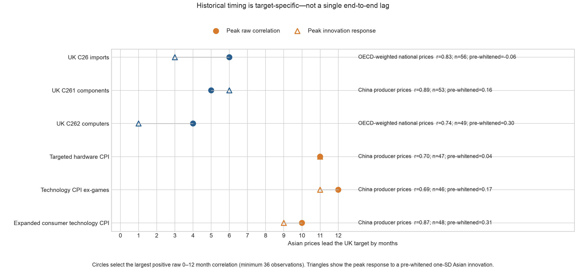
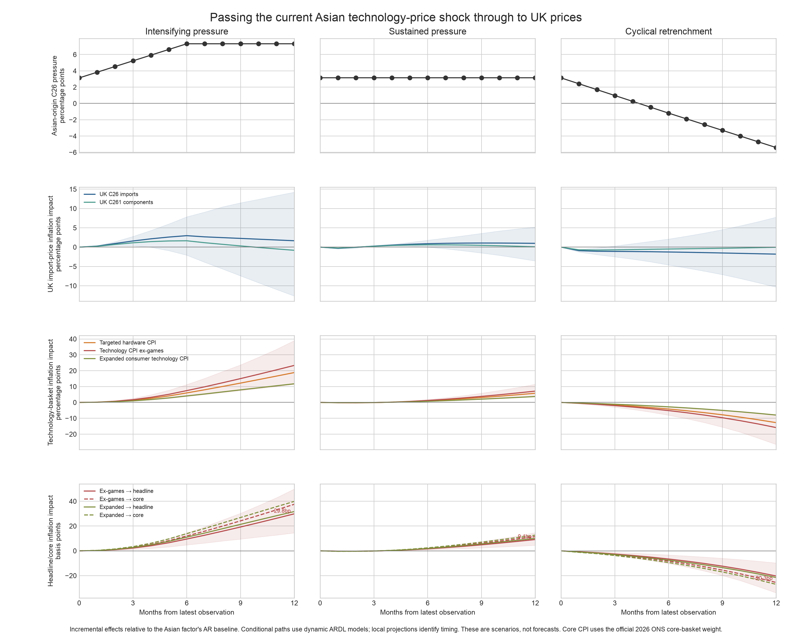

# Passing the current Asian technology-price shock through to UK inflation

## What can now be said

There are two distinct historical timing results. In raw annual inflation rates,
the strongest Asian indicators lead UK electronics import prices by roughly
**4–6 months** and the UK technology CPI measures by roughly **10–12 months**.
For example, the OECD-weighted national-price measure has a peak correlation of
0.83 with C26 import prices at six months, while China's sterling technology PPI
has correlations of 0.70 with targeted hardware at eleven months and 0.69 with
the ex-games measure at twelve months.

Those raw relationships are short-sample and largely disappear after AR(12)
pre-whitening: the corresponding residual correlations are -0.06, 0.04 and 0.17.
They therefore describe the timing of a shared global technology-price cycle,
not an independent causal coefficient. When the common Asian price factor is
instead converted into an unexpected AR(2) innovation, a UK import-price
response is detectable within **1–3 months** and peaks around **3–6 months**,
while the technology-CPI response builds and is largest at roughly **9–11
months**. This is the most defensible
version of the desired senior statement:

> Historically, broad Asian technology-price cycles have tended to appear in UK
> electronics import prices within about six months and in technology CPI around
> a year later. Unexpected common Asian price movements appear at the UK border
> within 1–3 months and peak around 3–6 months, while their association with CPI
> builds towards 9–11 months. The exact lag is target- and shock-dependent rather
> than fixed.



## Current shock and scenarios

The latest common Asian factor observation is June 2026. It is 1.02 standard
deviations above its sample mean, and its latest unexpected movement is 1.12
innovation standard deviations. Mapping the factor onto the OECD-weighted Asian
share of UK C26 import content gives a current pressure estimate of **3.13pp**.
The mapping has an in-sample R-squared of 0.989 because both measures are built
from the same three longer BLS origin series; it is a unit conversion, not an
independent validation.

Three transparent conditional paths are used:

- **Intensifying:** the factor rises to its historical 95th percentile by month
  six and stays there, raising implied C26 pressure from 3.13pp to 7.32pp.
- **Sustained:** current 3.13pp pressure persists for twelve months.
- **Cyclical retrenchment:** pressure falls to approximately zero after four
  months, turns negative, and reaches -5.42pp by month twelve.

C262 computer import prices remain in the historical timing scorecard but are
excluded from the current scenario projection because their reproducible series
ends in September 2025. Treating that stale observation as a June 2026 starting
condition would give a false impression of real-time precision.

For the scenario chart, each UK target is estimated with a `statsmodels` ARDL:
two target lags, contemporaneous-to-two-month Asian-factor lags, sterling and
broad Asian price controls. Scenario forecasts are compared with a baseline in
which the Asian factor follows its estimated AR(2) path. This dynamic model is
used for the headline scenario because mechanically convolving local-projection
responses to repeated overlapping annual-rate shocks produces implausibly large
double-counting. That convolution is retained only as a machine-readable
sensitivity.



## Scenario results

Under sustained pressure, the central ARDL estimates add approximately 0.9pp to
C26 import-price inflation at six months and 1.1pp at nine months. C261 peaks
near 0.6pp at six months. The ex-games technology basket effect builds from
1.25pp after six months to 7.12pp after twelve months. Given its 2026 CPI weight,
that translates into approximately **0.016pp on headline CPI after six months,
0.049pp after nine months and 0.091pp after twelve months**. Expressed against
the official 2026 core-CPI weight, the corresponding effects are 0.020pp, 0.061pp
and 0.115pp.

In the intensifying scenario, the ex-games contribution reaches about **0.095pp
after six months and 0.30pp after twelve months**. The expanded consumer-
technology destination gives a similar 0.32pp headline contribution at twelve
months because its lower estimated inflation response is offset by a larger CPI
weight. In the retrenchment scenario, the ex-games contribution is -0.066pp at
six months and -0.203pp at twelve months.

These are deliberately conditional scenario differences, not central forecasts.
The parameter uncertainty is material: for example, the intensifying C26 import
effect after six months has a 90% parameter interval of approximately -2.1pp to
7.8pp. The shaded bands in the chart show the 90% parameter uncertainty for C26,
ex-games CPI and its headline contribution. They do not cover data revisions,
model selection, quality adjustment or the possibility that today's AI-memory
shock differs structurally from the historical sample.

## Interpretation

The scenario exercise produces an operational hierarchy:

1. The 3.13pp upstream reading is an exposure measure.
2. A C26/C261 response within roughly 1–6 months would confirm that the pressure
   is reaching the UK border.
3. The strongest historical CPI association lies around 9–12 months.
4. The sustained central estimate reaches about 0.09pp on headline CPI after a
   year, while an intensification towards the historical upper tail reaches
   around 0.30pp.

The CPI estimates should not be treated as mechanically caused by chip prices.
The raw China correlations use only 46–53 observations, pre-whitened correlations
are weak, and annual inflation rates are highly persistent. The chart is best
used to discipline forecast judgement: monitor whether UK border and retail data
move along the predicted path, then update or abandon the scenario as evidence
arrives.

## Reproduction

```bash
uv run --frozen uk-tech download
uv run --frozen uk-tech scenarios
```

The main outputs are `data/processed/upstream_scenario_paths.csv`,
`data/processed/scenario_target_impacts.csv`,
`data/processed/scenario_macro_contributions.csv`,
`outputs/tables/transmission_correlation_scorecard.csv`, and the two charts above.
