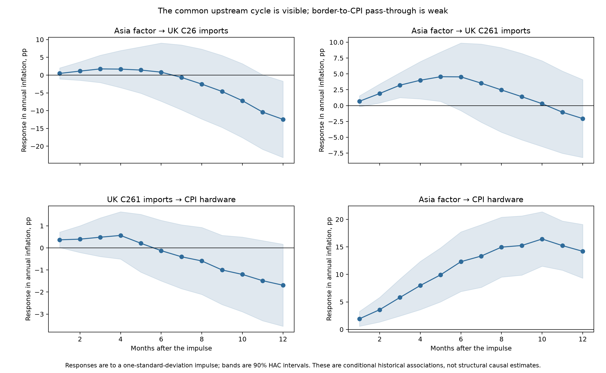

# Extending the UK measure and testing the full price-transmission chain

## Executive answer

The UK technology-goods measure can be extended well before the introduction of
COICOP5 without pretending that today's detailed components existed historically.
The preferred solution is a **classification bridge**: chain the official ONS
predecessor classes using their contemporaneous annual CPI weights, add the ONS
handset item indices when positive weights begin in 2005, and link the result to
the validated COICOP5 aggregate in January 2015. This produces a monthly targeted
hardware series from 1996 and, after annual-rate transformation, a usable inflation
history from 1997.

The longer sample changes the modelling conclusion in a useful way. China, Japan
and the Asian NIE computer/electronics border-price series share an exceptionally
strong common cycle: their first principal component explains **93.3%** of their
standardised variation. A recursively estimated ridge combination predicts UK C26
electronics import-price inflation better than own lags and broad controls at
3–10 months in the full sample, with RMSE reductions of about 8–17% at 4–10 months.
No fixed pass-through lag is stable across subperiods, however: the useful C26
window is nearer 3–5 months before 2020 and 8–12 months after 2022.

At the CPI stage, UK import prices and Asian prices work better jointly than either
simple weighted Asian average alone, especially at longer horizons in the full
sample. But local projections show that the historical C261-import-to-CPI
coefficient is positive only in the early months and is imprecise after multiple-
testing adjustment. The evidence therefore supports a combined risk model and a
sequential monitoring rule—not a mechanical, one-for-one CPI pass-through.

## 1. UK classification bridge

### Construction

The bridge uses only official ONS price indices and weights:

| Current destination | Historical source | Treatment |
|---|---|---|
| Audio-visual hardware | COICOP 09.1.1 (`D7EN`/`CJYC`) | Included in both historical measures |
| Photo and optical equipment | COICOP 09.1.2 (`D7EO`/`CJYD`) | Direct classification match |
| Information-processing equipment | COICOP 09.1.3 (`D7EP`/`CJYE`) | Parent of computers and peripherals |
| Recording media | COICOP 09.1.4 (`D7ES`/`CJYF`) | Included only in the broader ex-games sensitivity |
| Mobile equipment | ONS item IDs in the 1996–2019 archive | Item relatives and weights chained from 2005 |

Within each calendar year, component price relatives are aggregated with that
year's ONS CPI weights. January links are then chained across weight years. The
pre-2015 bridge is rescaled to the current aggregate in January 2015; from that
month onward, the observed COICOP5 aggregate is used unchanged. No model-based
values are imputed.


### Validation and use

There are 44 common annual-rate observations between the independently
constructed bridge and current classifications from January 2016 to August 2019.
For targeted hardware, the correlation is **0.986**, the mean absolute difference
is **0.89pp**, and RMSE is **1.08pp**. For the broader ex-games measure, correlation
is **0.960** and RMSE is **1.82pp**. The targeted hardware backcast is therefore the
preferred long-history modelling target. The broader version remains a sensitivity
because historical 09.1.4 recording media is wider than the current component.

This is a research series, not an official ONS back series. Its main break risks
are changes in product coverage, handset item sampling and quality adjustment.
Those risks are visible and documented in the configuration rather than hidden in
a statistical splice.

## 2. Hidden factors and combined regressions

Three longer, comparable sterling series are used: BLS computer/electronics
border-price indices for China, Japan and the Asian NIE group. The Asian NIE group
contains Hong Kong, Singapore, South Korea and Taiwan. The common factor has
near-equal loadings—0.586 for China, 0.583 for Japan and 0.563 for the Asian NIEs—
so it represents a regional technology-price cycle rather than a single-country
shock.

All forecast transformations are re-estimated at each forecast origin. Four
models are compared for UK import prices: own lags and broad controls; the same
model plus the OECD-weighted Asian price; plus the Asian common factor; and a
time-series-cross-validated ridge regression over all three Asian series. CPI
models similarly compare controls, a ridge combination of C26/C261/C262 UK import
prices, the Asian factor, and a combined ridge over both blocks. Forecasts are
direct, publication-aware and evaluated from one to twelve months.


The main results are:

- The simple OECD-weighted average and static common factor do not improve C26
  forecasts in the full sample. Allowing the three origin series to receive
  different, regularised coefficients does: the ridge model's RMSE ratios are
  0.92 at four months, 0.86 at five, 0.84 at eight and 0.83 at nine months.
- The C26 timing is not invariant. Ridge gains are concentrated around 3–5 months
  before 2020 and 8–12 months after 2022. C261 electronic-component prices show
  stronger pre-2020 gains, but long-horizon pre-2020 counts are small.
- UK import prices alone materially improve targeted-hardware CPI forecasts at
  9–12 months in the full sample. The combined Asian/import model reduces RMSE
  versus the controls model by about 32% at nine months, 41% at ten months and
  41% at twelve months. It also beats the import-only model at several horizons,
  but the incremental gain and useful horizon shift across subperiods.

This means that the data do contain useful joint predictive information. It does
not justify reporting a single structural lag such as “Asia reaches CPI after X
months”. A monitored horizon band is more defensible.

## 3. Imports, CPI exposure and estimated pass-through

The July OECD/BLS calculation currently implies **2.93pp** of Asian-origin pressure on
UK C26 import prices. Multiplying this by the current ex-games CPI weight and
assuming complete one-for-one pass-through gives **0.038pp** on headline CPI. That
is the useful upper mechanical exposure comparator.

The estimated historical C261-to-ex-games-CPI local-projection coefficients are
0.116 after one month, 0.183 after three months and 0.087 after six months for each
one percentage point of C261 inflation. Applied illustratively to the same 2.93pp
upstream pressure, these imply headline contributions of approximately **0.0044pp,
0.0069pp and 0.0033pp**, respectively. The coefficients are not significant after
false-discovery-rate adjustment, and they turn negative later. The broad C26
conditional coefficients are negative over much of the horizon, which is not a
credible structural cost coefficient and should not be used to make a forecast.



The gap between 0.038pp under full pass-through and the much smaller early-month
historical estimates is economically plausible. The UK import indices and CPI
have different product mixes; quality adjustment treats performance improvements
as effective price falls; firms can absorb costs in margins or inventories; and
contracts stagger border and retail repricing. The local projections are therefore
diagnostics of historical association, not causal estimates of the current shock.

## 4. Monitoring recommendation

Use three linked indicators:

1. **Upstream pressure:** the transparent OECD-weighted contribution for exposure,
   plus the recursively estimated ridge combination as the predictive signal.
2. **UK-border confirmation:** C261 first, then C26/C262 breadth. The common Asian
   factor historically leads C261 most clearly by roughly 1–3 months, although the
   wider C26 response is less precise.
3. **Retail confirmation:** targeted-hardware CPI and high-memory destinations,
   interpreted alongside product launches, quality changes and margins.

For forecast judgement, treat the full-pass-through contribution as an upper
scenario, not the central estimate. Raise the risk assessment when the weighted
exposure, combined model and UK import indicators all move in the same direction.
Only convert that signal into CPI judgement when border or retail evidence confirms
it, and avoid a fixed coefficient when the current shock is outside the historical
range.

## 5. Reproduction

```bash
uv sync --frozen
uv run --frozen uk-tech download-backcast
uv run --frozen uk-tech build
uv run --frozen uk-tech transmission
uv run --frozen pytest
```

Key machine-readable outputs are
`data/processed/uk_tech_indices_extended.csv`,
`data/processed/uk_tech_backcast_validation.csv`,
`data/processed/combined_transmission_evaluation.csv`,
`data/processed/transmission_local_projections.csv`, and
`outputs/tables/transmission_exposure_scenarios.csv`.
